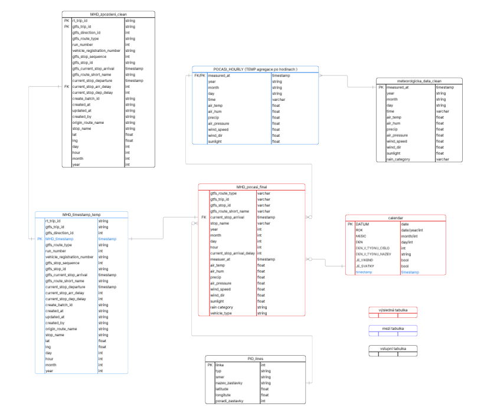
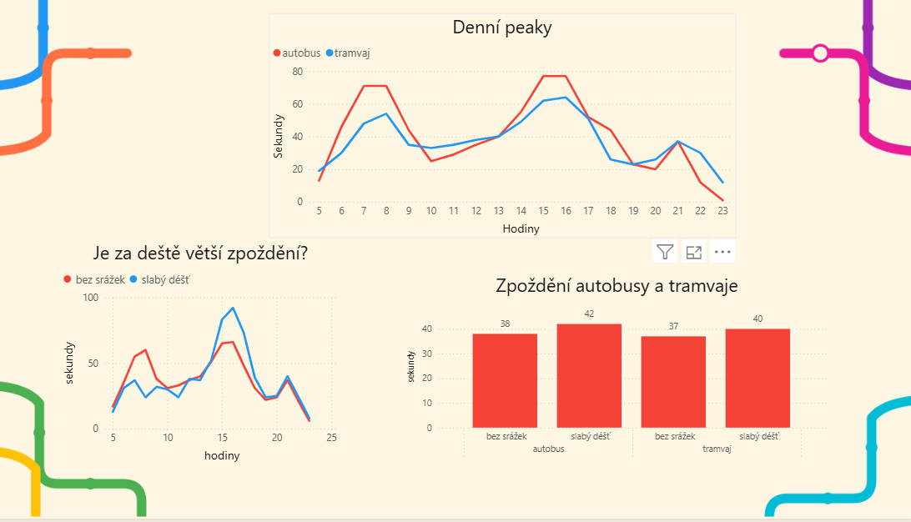
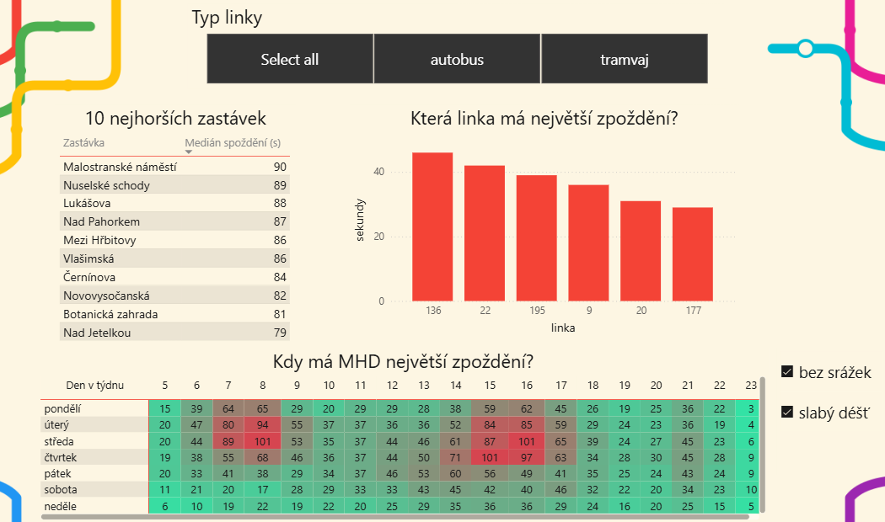

# Prague-Transport-and-Weather-analysis
This project was created as a final project for the Czechitas Digital Academy Data 2026.

The project analyzes the relationship between weather conditions and public transport delays in Prague.

The analysis combines operational transport data from Prague public transport with meteorological data to determine whether rainfall affects the punctuality of selected bus and tram lines.

## Team

- Dana Lamatová
- Andrea Jirásková

## Tools Used

- SQL
- Snowflake
- Keboola
- Power BI
- Python
- GitHub
- Lucidchart

## Data Sources

- Google Cloud API
- Windy API
- Golemio API
- Golemio / TSK Praha
- Czech Hydrometeorological Institute

## Project Workflow

1. Data collection via API
2. Data cleaning and transformation
3. Data modelling
4. SQL transformations
5. Power BI visualization
6. Interpretation of results

## My Contribution

- Data modelling
- SQL transformations
- Data cleaning
- Power BI dashboard development
- Data visualization
- Results interpretation

The original data collection scripts were developed by another team member and are therefore not included in this repository.

## Data Model

## SQL Examples

The data preparation and transformation workflow was implemented in Keboola using SQL transformations. Key steps included:

- Data cleaning
- Data aggregation
- Joining weather and transport data
- Creating the final analytical dataset

### Data Type Standardization
[SQL Example 1](https://gist.github.com/Lamatova/4f634bc14e7bbc2363360a2effe63d18)

### Create Calendar table
[SQL Example 2](https://gist.github.com/Lamatova/0d4c1381e8483a9729e2ed0aa6dd8680)

### Weather and Transport Data Integration
[SQL Example 3](https://gist.github.com/Lamatova/91cc0fbc75f204b960f80e11c2662657)

## Dashboard

## Key Findings

- Rain slightly increases public transport delays.
- Buses run approximately 38 seconds later than trams.
- Rush hour has a much stronger impact than weather.
- Bus line 136 had the highest median delay.
- Highest delays occurred during morning and afternoon peak traffic.

## Repository Structure

/SQL
/Python
/PowerBI
/Images
README.md
